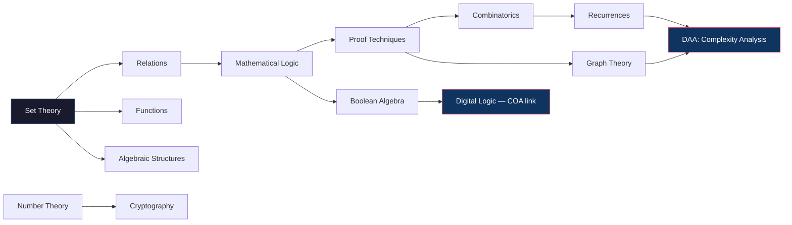

# Discrete-Mathematics-
# Discrete Mathematics — Roadmap

A structured map of discrete mathematics: where it came from, how its branches connect, and what each one covers. Built for GATE CSE 2027 preparation, sequenced by dependency rather than textbook order.

---

## Contents

- [Origins](#origins)
- [Roadmap Diagram](#roadmap-diagram)
- [Branch Dependency Map](#branch-dependency-map)
- [Set Theory](#set-theory)
- [Mathematical Logic](#mathematical-logic)
- [Relations](#relations)
- [Functions](#functions)
- [Combinatorics](#combinatorics)
- [Graph Theory](#graph-theory)
- [Number Theory](#number-theory)
- [Algebraic Structures](#algebraic-structures)
- [Recurrence Relations](#recurrence-relations)
- [Boolean Algebra](#boolean-algebra)
- [GATE Weightage Summary](#gate-weightage-summary)
- [Recommended Study Sequence](#recommended-study-sequence)

---

## Origins

Discrete mathematics is not one historical lineage — it is several separate traditions that computer science later fused into a single subject.

**Ancient roots — counting and combinatorics.** The earliest discrete reasoning appears in Indian and Greek antiquity: Pingala's work on binary-like counting for Sanskrit prosody (c. 3rd century BCE), and early combinatorial problems in Greek and Indian mathematics dealing with permutations and arrangements.

**17th–18th century — the birth of formal combinatorics and graph theory.** Blaise Pascal and Pierre de Fermat formalized combinatorics while working on probability (1654). Leonhard Euler founded graph theory in 1736 by solving the Seven Bridges of Königsberg problem — the first proof that a problem could be solved by representing a physical situation as an abstract structure of nodes and edges, rather than through geometry or measurement.

**19th century — the algebra of logic.** George Boole published *The Laws of Thought* (1854), reducing logical reasoning to algebraic operations — AND, OR, NOT — over the values 0 and 1. This is the direct ancestor of Boolean algebra and, later, digital circuit design. Georg Cantor, in the 1870s–1880s, built set theory from first principles and proved that infinities come in different sizes, giving mathematics its modern foundational language.

**Early 20th century — formal logic and foundations.** Gottlob Frege, Bertrand Russell, and David Hilbert pursued the project of grounding all of mathematics in formal logic and set theory. This effort produced predicate logic, formal proof systems, and — through Kurt Gödel's incompleteness theorems (1931) — the discovery that some truths cannot be proven within any sufficiently powerful formal system.

**1930s–1940s — computability and the discrete turn.** Alan Turing (1936) and Alonzo Church defined computation itself in discrete terms: a Turing machine manipulates a finite alphabet of symbols in discrete steps. This is the moment discrete mathematics stopped being a loose collection of topics and became the mathematical foundation of computing.

**Mid-to-late 20th century — computer science absorbs discrete math wholesale.** Claude Shannon's 1937 master's thesis showed that Boolean algebra directly models switching circuits — the theoretical basis of all digital electronics. Graph theory became the language of networks and data structures. Combinatorics became the tool for counting algorithmic possibilities and proving complexity bounds. Number theory, once considered the purest and most "useless" branch of mathematics, became the backbone of modern cryptography (RSA, 1977) once computers made large-scale modular arithmetic practical.

The result: discrete mathematics as taught today is a *retroactively unified* subject — logic from Boole and Frege, sets from Cantor, graphs from Euler, combinatorics from Pascal and Fermat, algebraic structures from Galois and Cayley, all pulled together because computer science needs precisely these tools to reason about finite, discrete systems: circuits, algorithms, data structures, networks, and proofs of correctness.

---

## Roadmap Diagram

```mermaid
flowchart TD
    A[Discrete Mathematics] --> B[Set Theory]
    A --> C[Mathematical Logic]
    A --> D[Combinatorics]
    A --> E[Graph Theory]
    A --> F[Number Theory]
    A --> G[Algebraic Structures]

    B --> B1[Set Operations]
    B --> B2[Relations]
    B --> B3[Functions]
    B2 --> B2a[Equivalence Relations]
    B2 --> B2b[Partial Orders / Posets]
    B3 --> B3a[Injective / Surjective / Bijective]
    B3 --> B3b[Composition & Inverses]

    C --> C1[Propositional Logic]
    C --> C2[Predicate Logic]
    C --> C3[Proof Techniques]
    C1 --> C1a[Truth Tables]
    C1 --> C1b[Boolean Algebra]
    C3 --> C3a[Induction]
    C3 --> C3b[Contradiction / Contrapositive]

    D --> D1[Permutations & Combinations]
    D --> D2[Pigeonhole Principle]
    D --> D3[Recurrence Relations]
    D --> D4[Generating Functions]
    D3 --> D3a[Linear Homogeneous]
    D3 --> D3b[Master Theorem link to DAA]

    E --> E1[Graph Basics]
    E --> E2[Trees]
    E --> E3[Graph Algorithms]
    E --> E4[Graph Coloring]
    E1 --> E1a[Degree, Paths, Cycles]
    E1 --> E1b[Connectivity]
    E3 --> E3a[BFS / DFS — feeds DAA]
    E3 --> E3b[Shortest Path — feeds DAA]

    F --> F1[Divisibility & GCD]
    F --> F2[Modular Arithmetic]
    F --> F3[Primes]
    F2 --> F2a[Cryptography link]

    G --> G1[Groups]
    G --> G2[Rings & Fields]
    G1 --> G1a[Group Axioms]
    G1 --> G1b[Cyclic Groups]

    style A fill:#1a1a2e,stroke:#0f3460,color:#fff
    style B fill:#16213e,stroke:#0f3460,color:#fff
    style C fill:#16213e,stroke:#0f3460,color:#fff
    style D fill:#16213e,stroke:#0f3460,color:#fff
    style E fill:#16213e,stroke:#0f3460,color:#fff
    style F fill:#16213e,stroke:#0f3460,color:#fff
    style G fill:#16213e,stroke:#0f3460,color:#fff
```

*Note: Mermaid diagrams render natively in GitHub READMEs. No external image hosting needed.*

---

## Branch Dependency Map

Which branches you need before others make sense.

The two right-hand endpoints — **Algorithms** and **Digital Logic** — are why discrete math sits where it does in the GATE syllabus: it's not decorative theory, it's the direct prerequisite for DAA complexity proofs and COA/Digital Logic circuit reasoning.

---

## Set Theory

The foundational language everything else is written in.

- **Set operations** — union, intersection, difference, complement, power set, Cartesian product
- **Set identities** — De Morgan's laws, distributive laws, absorption laws
- **Cardinality** — finite, countably infinite, uncountably infinite sets
- **Venn diagram reasoning** — inclusion-exclusion principle for counting unions of sets

Exam trap: inclusion-exclusion for 3+ sets is frequently tested and frequently miscounted — students forget the triple-intersection term.

## Mathematical Logic

The rules for what counts as a valid argument.

- **Propositional logic** — statements, connectives (∧, ∨, ¬, →, ↔), truth tables
- **Logical equivalences** — tautologies, contradictions, satisfiability
- **Predicate logic** — quantifiers (∀, ∃), nested quantifiers, negating quantified statements
- **Proof techniques** — direct proof, proof by contradiction, contrapositive, mathematical induction (weak and strong), proof by cases

Exam trap: negating a statement with nested quantifiers (∀x∃y...) is a recurring GATE question type — swap quantifiers *and* negate the inner predicate.

## Relations

How elements of sets connect to each other.

- **Properties** — reflexive, symmetric, antisymmetric, transitive
- **Equivalence relations** — partition a set into equivalence classes
- **Partial orders (posets)** — Hasse diagrams, minimal/maximal elements, lattices
- **Closures** — reflexive closure, symmetric closure, transitive closure (Warshall's algorithm)

## Functions

A special, restricted kind of relation — but treated separately because of its algorithmic importance.

- **Types** — injective (one-to-one), surjective (onto), bijective
- **Composition and inverses**
- **Growth-rate functions** — this is where discrete math quietly feeds into asymptotic notation (O, Ω, Θ) used constantly in DAA

## Combinatorics

The mathematics of counting without enumerating.

- **Permutations and combinations** — with and without repetition, circular permutations
- **Pigeonhole principle** — guarantees existence without construction; deceptively simple, frequently misapplied
- **Binomial theorem and Pascal's identity**
- **Recurrence relations** — linear homogeneous recurrences with constant coefficients, characteristic equations
- **Generating functions** — encoding sequences as coefficients of power series (less GATE-weighted, but conceptually clarifies recurrences)

Direct link forward: recurrence relations here are the same mathematical object as the recurrences you solve in DAA for algorithm time complexity (Master Theorem, recursion trees).

## Graph Theory

Euler's 1736 abstraction, still the working model for networks, data structures, and algorithms.

- **Basics** — vertices, edges, degree, walk/path/cycle, connectivity, complete/bipartite graphs
- **Trees** — spanning trees, minimum spanning trees (Kruskal, Prim — shared territory with DAA)
- **Graph representations** — adjacency matrix vs. adjacency list (shared territory with DSA)
- **Graph traversal** — BFS, DFS (shared territory with DSA/DAA)
- **Graph coloring** — chromatic number, applications to scheduling
- **Planarity** — Euler's formula (V − E + F = 2), Kuratowski's theorem

Exam trap: GATE frequently blends graph theory with DAA (shortest path, MST) and DSA (traversal) — treat this as one continuous topic, not three separate silos, when building your subject pairing.

## Number Theory

Once "pure" mathematics with no application; now the backbone of cryptography.

- **Divisibility** — GCD, LCM, Euclidean algorithm
- **Modular arithmetic** — congruences, modular exponentiation
- **Primes** — prime factorization, Fermat's little theorem, Euler's totient function
- **Application** — RSA cryptography relies directly on modular exponentiation and the difficulty of factoring large primes

## Algebraic Structures

Where set theory meets operations — light in GATE weightage but occasionally tested.

- **Groups** — closure, associativity, identity, inverse (the four group axioms)
- **Abelian groups**, cyclic groups, subgroups
- **Rings and fields** — brief conceptual coverage, rarely deep in GATE CSE

## Recurrence Relations

Given separate emphasis here because of its dual role — combinatorics topic *and* DAA prerequisite.

- **Linear homogeneous recurrences** — characteristic root method
- **Non-homogeneous recurrences** — particular + homogeneous solution
- **Master theorem** — the direct bridge into algorithm complexity analysis (divide-and-conquer recurrences)

## Boolean Algebra

Boole's 1854 algebra of logic, now the mathematics of digital circuits.

- **Boolean operations** — AND, OR, NOT, XOR
- **Boolean identities and simplification** — De Morgan's laws applied to circuits
- **Canonical forms** — SOP (sum of products), POS (product of sums)
- **Karnaugh maps** — visual simplification of Boolean expressions
- **Direct application** — this is the mathematical foundation of the Digital Logic and COA syllabus (logic gates, combinational circuits)

---

## GATE Weightage Summary

| Branch | Typical GATE Weight | Feeds Into |
|---|---|---|
| Combinatorics & Counting | High | DAA (complexity), Probability |
| Graph Theory | High | DAA, DSA |
| Set Theory, Relations, Functions | Medium-High | Logic, foundational for everything |
| Mathematical Logic (Propositional/Predicate) | Medium | Proof-based questions across subjects |
| Recurrence Relations | Medium | DAA (Master Theorem) |
| Number Theory | Low-Medium | Cryptography, occasional standalone questions |
| Boolean Algebra | Medium | Digital Logic, COA |
| Algebraic Structures (Groups/Rings) | Low | Rarely deep, occasional 1-mark question |

Discrete Mathematics is typically clubbed with Engineering Mathematics in GATE CSE and together contributes a significant share of the paper — historically in the 13–15 mark range across both.

---

## Recommended Study Sequence

1. Set Theory → Relations → Functions (foundation layer, cannot skip)
2. Mathematical Logic → Proof Techniques (needed before combinatorics proofs make sense)
3. Combinatorics → Recurrence Relations (pair with DAA complexity analysis)
4. Graph Theory (pair with DSA traversal algorithms and DAA shortest-path/MST)
5. Boolean Algebra (pair with Digital Logic / COA)
6. Number Theory (standalone, lower priority, revisit near the end)
7. Algebraic Structures (lowest priority, light pass only)

This sequence matches the subject-pairing strategy already in use for the six-phase GATE plan: Discrete Math is not an isolated subject block — its subtopics are distributed across the DAA, DSA, and Digital Logic/COA phases as prerequisite scaffolding rather than studied in one continuous sitting.
